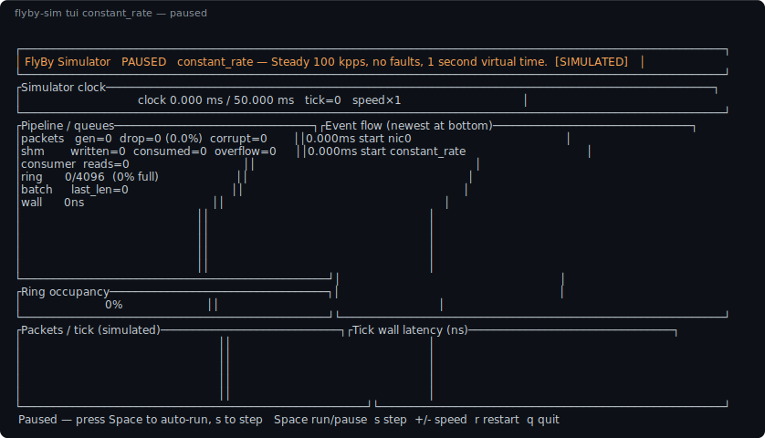
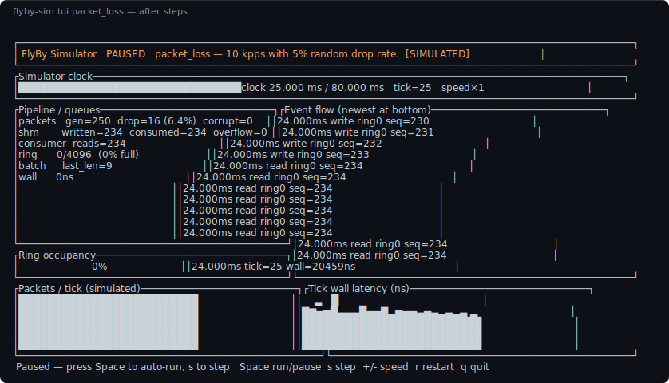
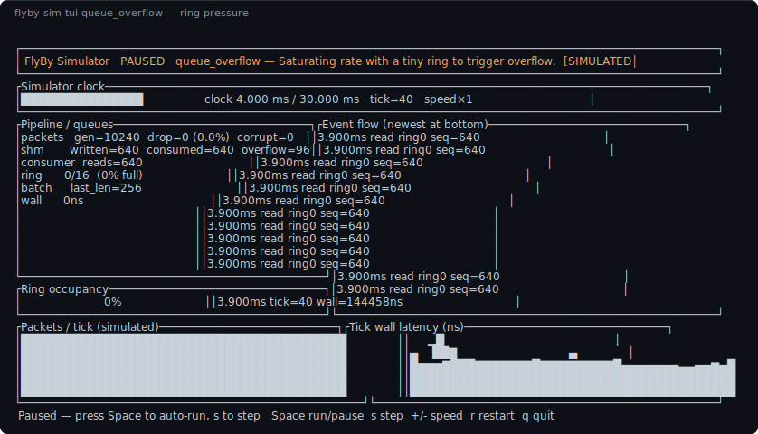

# Simulator

The FlyBy simulator is a **product feature**, not a test stub (ADR-007,
ADR-008). It lets developers understand, debug, benchmark, and demonstrate
the pipeline without privileged Linux networking, AF_XDP, DPDK, SPDK, or
NVMe hardware.

The crate lives at `simulator/` (`flyby-simulator`). Production backends and
the simulator share the same source traits; only the adapters differ.

## Architecture

```text
Virtual NICs / Pcap      Virtual Storage
      │                         │
      └────────────┬────────────┘
                   ▼
            Source Adapters
                   ▼
             Raw Batch Stream
                   ▼
          Virtual Shared Memory
                   ▼
          Virtual Consumers
```

## Components

| Type | Role |
|---|---|
| `VirtualNic` | `NetworkSource` with traffic pacing + payload generators + faults |
| `PcapSource` | Classic pcap ingest with `SimReplay` timing |
| `VirtualStorageSource` | `StorageSource` wrapping `FileSource` + faults |
| `SimClock` | Real time or deterministic virtual time |
| `TrafficPacer` | Fixed-rate / burst / Gaussian / full-speed emission |
| `PayloadSpec` | Fixed-seq, random, Gaussian size, protocol-aware, custom callbacks |
| `FaultInjector` | LCG-seeded drop, corrupt, latency spikes |
| `SimScheduler` | Tick loop, metrics, optional ring + consumers, timeline |
| `VirtualSharedMemory` | In-process SPSC byte-slot ring |
| `VirtualConsumer` | Drains the ring (supports slow-consumer mode) |
| `SimReplay` | Virtual-clock adapter over storage `ReplayMode` |
| `Scenario` | Built-in Rust run presets |
| FlyScenario DSL | TOML + optional Rhai → same runtime — [full reference](./scenario-dsl.md) |
| `TimelineAction` | Timed traffic / fault / consumer mutations |
| `EduControls` | Pause, step, breakpoints, batch inspection |
| TUI dashboard | Ratatui view of clock, queues, events, sparklines |

## CLI cheat sheet

```text
flyby-sim [builtin]                 # headless built-in preset
flyby-sim run <file.fly.toml>       # headless FlyScenario DSL
flyby-sim <path/to/file.fly.toml>   # same (path auto-detected)
flyby-sim tui [builtin|file]        # Ratatui dashboard
flyby-sim pcap <path> [--full-speed]
```

```bash
cargo run -p flyby-simulator --bin flyby-sim -- constant_rate
cargo run -p flyby-simulator --bin flyby-sim -- run scenarios/constant_rate.fly.toml
cargo run -p flyby-simulator --bin flyby-sim -- tui packet_loss
cargo run -p flyby-simulator --bin flyby-sim -- pcap simulator/fixtures/tiny_3pkt.pcap --full-speed
```

Throughput and latency numbers from the CLI are **simulated**.

## Built-in scenarios

| Name | Description |
|---|---|
| `constant_rate` | Steady 100 kpps, no faults, 1 s |
| `market_open_burst` | 10k-packet bursts with 1 ms gap, 5 s |
| `queue_overflow` | Full-speed + tiny ring → measurable overflow |
| `packet_loss` | 10 kpps with 5% drop |
| `slow_consumer` | 1 kpps with latency spikes (slow drain in CLI) |
| `corrupt_packets` | 1% payload corruption |
| `gaussian_rate` | Gaussian arrivals ~ N(50k, 10k) pps |
| `protocol_quotes` | Binary market-quote payloads (AAPL) |

Resolve in Rust with `Scenario::by_name` / `Scenario::builtin_names()`.

## Tutorial DSL scenarios

Checked-in files under [`scenarios/`](../../scenarios/):

| File | Shows |
|---|---|
| `constant_rate.fly.toml` | Minimal NIC + fabric + consumer |
| `market_open_lossy.fly.toml` | Burst traffic + `[[timeline]]` faults / slowdown |
| `rhai_drop_ramp.fly.toml` | Phase 3 Rhai `[script]` ramp |

## Traffic generators

```rust,ignore
use flyby_simulator::{PayloadSpec, ProtocolMessage, TrafficConfig, TrafficPattern};

// Gaussian arrivals
let gaussian = TrafficConfig::gaussian_rate();

// Protocol-aware binary quotes
let quotes = TrafficConfig {
    pattern: TrafficPattern::FixedRate { pps: 10_000 },
    payload_size: 34,
    batch_size: 64,
    payload: PayloadSpec::Protocol(ProtocolMessage::market_quote("AAPL")),
};

// Custom callback
use std::sync::Arc;
let custom = TrafficConfig {
    payload: PayloadSpec::Custom(Arc::new(|seq, buf| {
        buf.fill(0);
        buf[0] = (seq & 0xFF) as u8;
    })),
    ..TrafficConfig::default()
};
```

Patterns: **fixed-rate**, **burst**, **Gaussian**, **full-speed**.
Payloads: **fixed-seq**, **random**, **Gaussian size**, **protocol**, **custom**.

## Fault injection

Every injected fault is observable (`SimEvent` + counters):

| Fault | Effect |
|---|---|
| Drop | Packet removed from the delivered batch |
| Corrupt | One payload byte flipped |
| Latency spike | Virtual time advances by `latency_spike_ns` |

```rust,ignore
use flyby_simulator::FaultSpec;

let fault = FaultSpec {
    drop_rate: 0.05,
    corrupt_rate: 0.01,
    latency_spike_rate: 0.10,
    latency_spike_ns: 500_000,
};
```

Same rates appear in FlyScenario as `[nic.fault]` / timeline `set_fault`.

## Virtual time

| Mode | Behaviour |
|---|---|
| `ClockMode::Virtual` | Time advances only on scheduler ticks (+ spikes) |
| `ClockMode::RealTime` | Wall clock |

Virtual time is the default for deterministic tests and CI.

## Virtual shared memory and consumers

`SimScheduler::with_ring` attaches an in-process SPSC byte-slot ring.
`VirtualConsumer` drains it each tick; `VirtualConsumer::slow` limits
slots per drain to exercise back-pressure and overflow.

## Pcap ingest

Classic pcap only (not pcap-ng). Convert with `editcap -F pcap` if needed.
Fixtures live under `simulator/fixtures/`.

```bash
cargo run -p flyby-simulator --bin flyby-sim -- pcap capture.pcap --full-speed
```

```rust,ignore
use flyby_simulator::{PcapConfig, PcapSource, load_pcap, NullEventSink};
use flyby_storage::ReplayMode;

let packets = load_pcap("capture.pcap")?;
let src = PcapSource::new(
    packets,
    PcapConfig { replay: ReplayMode::OriginalTiming, ..Default::default() },
    NullEventSink,
)?;
```

Replay modes (also via DSL `[[pcap]] replay = …`): `FullSpeed`,
`OriginalTiming`, `TimeScaled`, `Burst`, `SingleStep` — driven by
`SimReplay` against the simulator clock.

## Events and metrics

- **Events** — `EventSink` (`NullEventSink` / `VecEventSink`); kinds cover
  packet gen/drop/corrupt, ring write/overflow, consumer read, ticks,
  lifecycle.
- **Metrics** — `SimMetricKey` (`sim.*` namespace) via `MetricsCollector`.

Use `NullEventSink` for quiet benchmark runs.

## Educational controls

```rust,ignore
use flyby_simulator::{EduControls, SimScheduler};

let mut sched = SimScheduler::new(scenario).with_edu(EduControls {
    paused: true,
    breakpoint_tick: Some(10),
    ..EduControls::default()
});
sched.run()?;          // arms without ticking while paused
while sched.step()? {} // single-step
sched.finish_run()?;
```

`last_batch()` exposes the most recent delivered batch for inspection.
The TUI maps Space / `s` onto pause and step.

## FlyScenario DSL

Declarative TOML under `scenarios/*.fly.toml` (optional Rhai `[script]`)
compiles to the same scheduler. Language surface:

| Construct | Purpose |
|---|---|
| `[scenario]` | name, duration, tick, clock, mode, seed |
| `[[nic]]` | virtual NIC + traffic / payload / fault |
| `[[pcap]]` | classic pcap replay |
| `[fabric]` | virtual shared-memory ring |
| `[[consumer]]` | drain budget (`"unlimited"` or N) |
| `[[timeline]]` | timed `set_traffic` / `set_fault` / `slow_consumer` |
| `[script]` | Phase 3 Rhai → timeline actions |

**Full field reference, Rhai API, and end-to-end examples:**
[FlyScenario DSL](./scenario-dsl.md).

```bash
cargo run -p flyby-simulator --bin flyby-sim -- run scenarios/market_open_lossy.fly.toml
cargo run -p flyby-simulator --bin flyby-sim -- run scenarios/rhai_drop_ramp.fly.toml
```

## TUI dashboard

The Ratatui dashboard is the interactive way to watch a scenario: clock,
ring occupancy, drop counters, event flow, and sparklines. Feature `tui`
is enabled by default.

### Launch

```bash
# Steady baseline
cargo run -p flyby-simulator --bin flyby-sim -- tui constant_rate

# Fault injection (watch drop %)
cargo run -p flyby-simulator --bin flyby-sim -- tui packet_loss

# Tiny ring — occupancy / overflow pressure
cargo run -p flyby-simulator --bin flyby-sim -- tui queue_overflow

# Protocol-aware payloads
cargo run -p flyby-simulator --bin flyby-sim -- tui protocol_quotes

# FlyScenario DSL file
cargo run -p flyby-simulator --bin flyby-sim -- tui scenarios/market_open_lossy.fly.toml
```

Requires a real terminal (not all CI log scrapers). For headless builds
without Ratatui: `--no-default-features`.

### Keyboard controls

| Key | Action |
|---|---|
| `Space` | Toggle auto-run / pause |
| `s` or `→` | Single-step one scheduler tick |
| `+` / `-` | Increase / decrease ticks per UI frame |
| `r` | Restart the scenario from tick 0 |
| `q` or `Esc` | Quit (also `Ctrl-C`) |

Suggested first session: start paused → press `s` a few times → `Space` to
auto-run → `+` to speed up → `q` to exit.

### What each pane shows

1. **Header** — scenario name, PAUSED/AUTO/DONE badge, **\[SIMULATED\]** label  
2. **Simulator clock** — virtual-time progress through the scenario duration  
3. **Pipeline / queues** — packets generated/dropped/corrupted, SHM writes,
   consumer reads, ring fill, last batch size  
4. **Ring occupancy** — gauge for shared-memory back-pressure  
5. **Event flow** — recent faults, ticks, lifecycle (quieter during fast auto-run)  
6. **Sparklines** — packets per tick and tick wall-latency (ns)  
7. **Footer** — status line + key hints  

### Screenshots

Captured from the live dashboard via the TestBackend (regenerate with
`cargo run -p flyby-simulator --example render_tui_docs`).

**Paused at start** (`constant_rate`):



**After stepping** (`packet_loss` — note the drop counter):



**Ring pressure** (`queue_overflow`):



Plain-text copies of the same frames live beside the SVGs in
[`docs/src/images/tui/`](./images/tui/) for diff-friendly reviews.

### Regenerating screenshots

```bash
cargo run -p flyby-simulator --example render_tui_docs
```

## Medium articles

Publishing hooks live under `articles/` (catalog + screenshots + expected
output). Reproduce a post with:

```bash
./scripts/reproduce-article.sh part-vi-simulator-intro
```

See [Medium articles](./articles.md).

## When not to use it

Do not quote simulator throughput or latency as production figures. Use it
for correctness, relative comparisons, tutorials, and CI.

## Related

- [FlyScenario DSL](./scenario-dsl.md)
- [Medium articles](./articles.md)
- [ADR-0007: Simulator before hardware](./adr/0007-simulator-before-hardware.md)
- [ADR-0008: Simulator is a product feature](./adr/0008-simulator-is-a-product-feature.md)
- Crate README: [`simulator/README.md`](../../simulator/README.md)
